# ArtifyMe Portfolio Project

## 📋 Table of Contents
- [Overview](#overview) 🌐
- [Technologies Used](#technologies) ⚙️
- [Features](#features) 🚀
- [Setup](#setup) ⚙️
- [Contact](#contact) 📫
- [Database Schema](#databaseschema) 📊
- [Screenshots](#screenshots) 📸
- [Acknowledgments](#acknowledgments) 🙌

## <a name="overview">🌐 Overview </a>
ArtifyMe is a mobile application that allows users to convert sketches into images using AI. The app has a React Native frontend for the mobile interface, a Java Spring Boot backend with jwt authentication that handles server operations, and a Python FastAPI for generating images from sketches using Stable Diffusion.
ß
## <a name="technologies">⚙️ Technologies Used </a>
- Frontend: [React Native](https://reactnative.dev/)
  
  - Expo: [Expo](https://expo.dev/)
    
  - Form Validation: [Yup](https://github.com/jquense/yup)
    

- Backend: Java Spring Boot, Python FastAPI
  
  

- Authentication: [Java Spring Boot Security JWT Authentication](https://spring.io/projects/spring-security)
  

- Database: [Spring Data MongoDB](https://spring.io/projects/spring-data-mongodb)
  

- Image Storage: [S3-AmazonWebServices](https://aws.amazon.com/s3/)
  

- AI Integration: Stable Diffusion v1.5
  

## <a name="features">🚀 Features </a>
- **Sketch-to-Image Conversion:** Utilize AI Stable Diffusion model via a Python FastAPI to convert sketches into stunning images effortlessly using img2img.
- **Interactive Canvas:** Enjoy a fully interactive canvas experience with adjustable brush sizes, a diverse range of colors to choose from, and convenient options for clearing and undoing actions.
- **Secure Authentication:** Robust JWT token-based authentication and authorization mechanisms, seamlessly integrated with a secure Java Spring Boot backend, ensuring the safety and privacy of user data.
- **CRUD Operations:** Explore comprehensive CRUD (Create, Read, Update, Delete) functionalities to manage creations efficiently. Save, edit, and delete your sketches with ease, and share your masterpieces effortlessly with friends.
- **Profile Management:** Experience seamless user account management, including user sign-up, login, and password management, all backed by a secure Java backend for enhanced security and reliability.
- **Cloud Storage Integration and Database:** All user creations are stored in Amazon Web Services (AWS) S3 bucket, providing scalable and reliable cloud storage solution for enhanced accessibility. Additionally, leverage MongoDB Atlas database for efficient data management and storage.
- **Dark Mode:** Enhance your user experience with a sleek and modern dark mode interface.
- **Pagination:** Navigate through your artwork collection effortlessly with pagination.
- **Artwork Details:** Dive deeper into your artworks with dedicated artwork details screens, offering full-screen viewing capabilities to appreciate every detail.
- **Form Validation:** Ensure the integrity and quality of user-generated content with yup form validation.
- **Global State Management:** Utilizes global state management so that users can browse through previously generated artworks while a new one is being created. 

## <a name="setup"> ⚙️ Setup </a>

Clone the repository: `git clone https://github.com/tomyRomero/artifyme`

Please place close attention to the env examples for the frontend as well as the application properties example for the backend (found in src/main/resources/). Ensure you have set the proper variables before starting the application or you will experience errors.

**Frontend:**
1. Navigate to the project directory: `cd frontend`
2. Install dependencies: `npm install`
3. Start the development server: `npm start`

Ensure that you have java and maven installed with the necessary versions, they can be found in the pom.xml, for example the java I used was 20, and Maven was 4.0.0, spring-boot was 3.2.3. Ensure that you have these systems up and running if you want to test the server locally, ensure that you have maven and java as environmental variables on your pc.

**Backend:**
1. Navigate to the project directory: `cd backend`
2. Install dependencies: `mvn clean install`
3. Start the Spring Boot server: `mvn spring-boot:run`

**AI Integration:**
1. Navigate to the project directory: `cd fastapi`
2. Install dependencies: `pip install -r requirements.txt`
3. Start the Python server: `uvicorn main:app --host 0.0.0.0 --port 8000`
3. Install Stable Diffusion library: on the first initial run allow for the stable diffusion model to be downloaded, 
please note that speed of image generation depends on strength of computer, you can increase the number of inference steps, main.py for better results however will result in longer wait times.

In main.py, line 25, the code is for macOS
`pipe = pipeline.to("mps")` 
For Windows or Linux systems, you can use "cuda" instead of "mps" if you have a compatible GPU and CUDA installed. "cuda" will utilize the GPU for faster processing.

If you don't have a compatible GPU or CUDA installed, you can use "cpu" to run the model on the CPU.

Ensure all three softwares are up and running for app to be fully functional.
Any questions or errors please contact me.

## <a name="contact"> 📫 Contact </a>
For any inquiries or support, please contact me: tomyfletcher99@hotmail.com 

## <a name="databaseschema"> 📊 Database Schema </a>
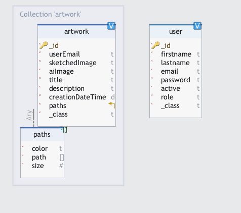

## <a name="screenshots"> 📸 Screenshots </a>
Screenshots of the mobile app interface and functionalities.  
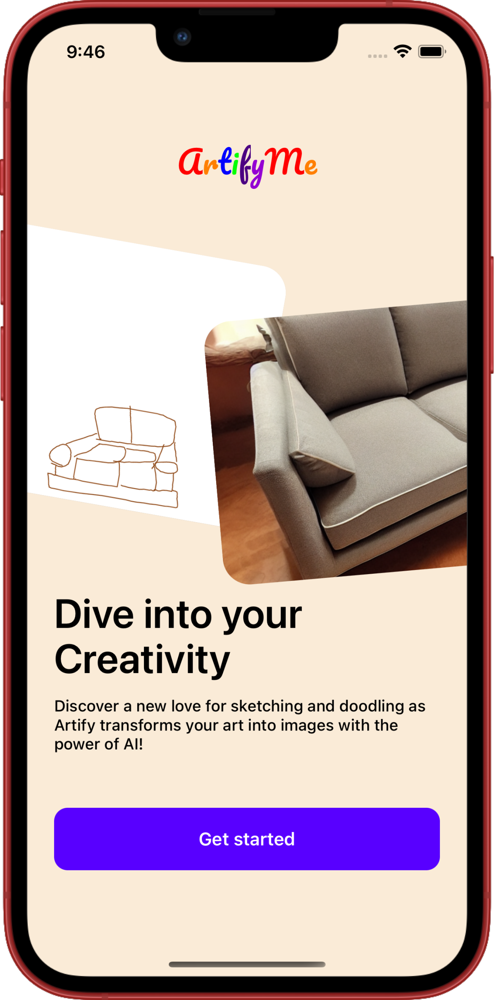 
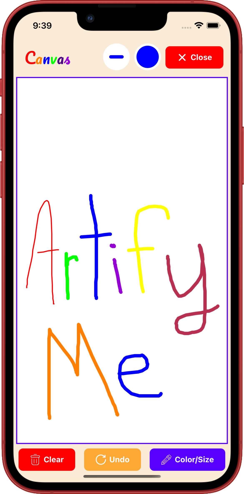 
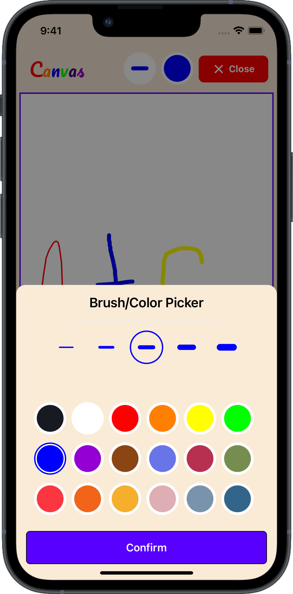 
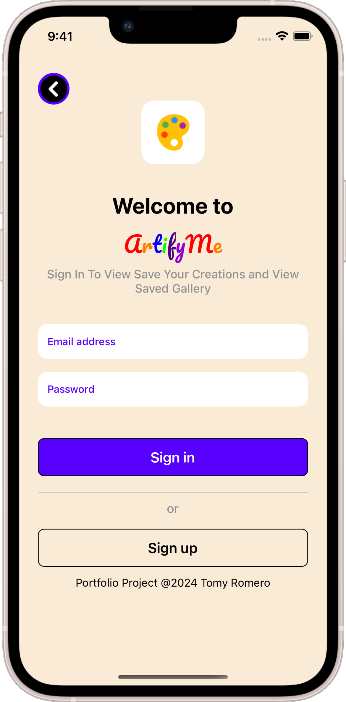 
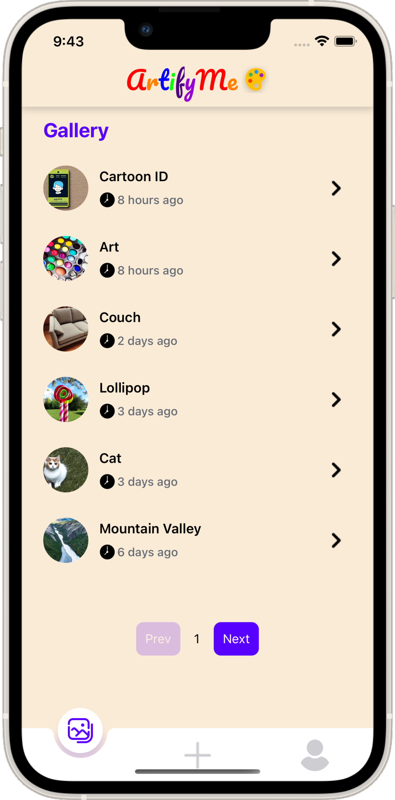 
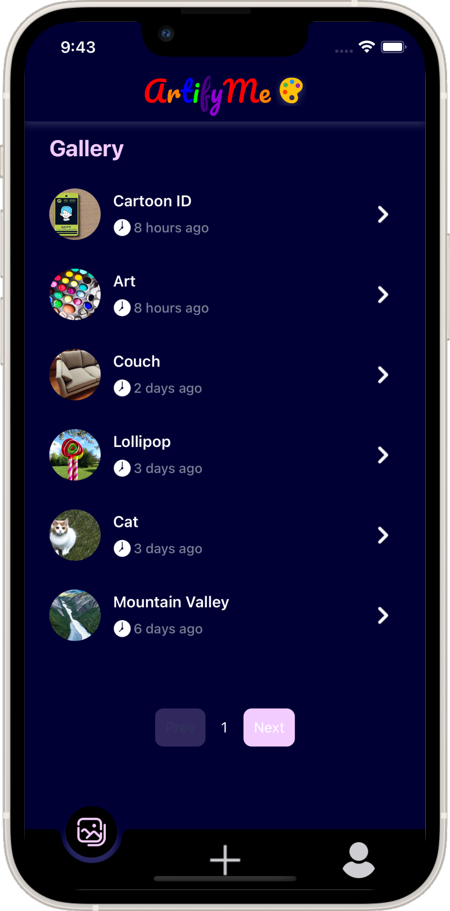 
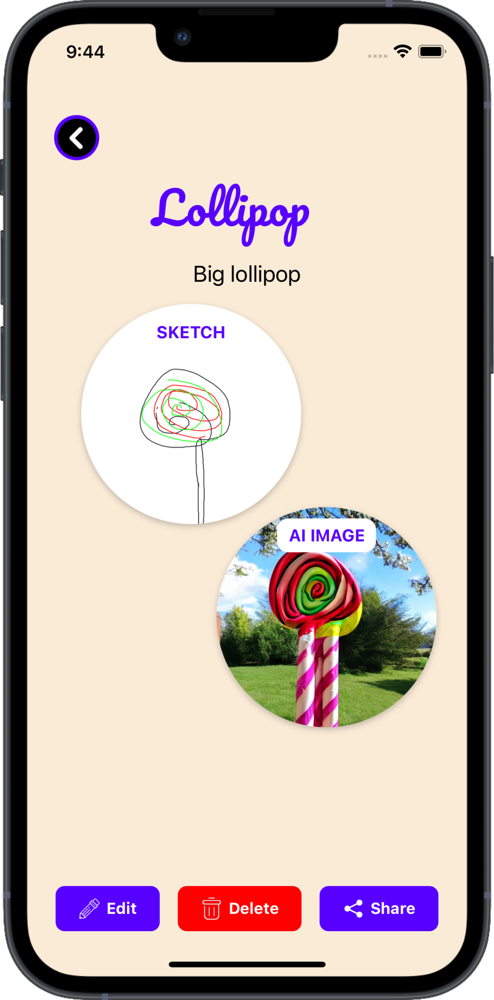 
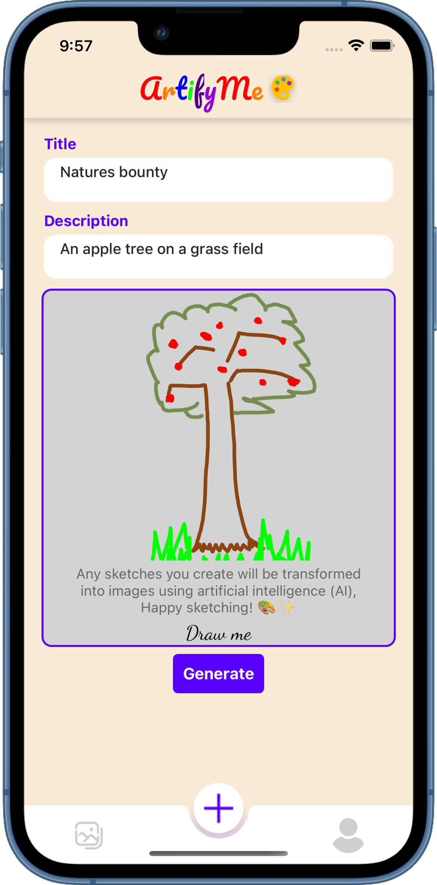 
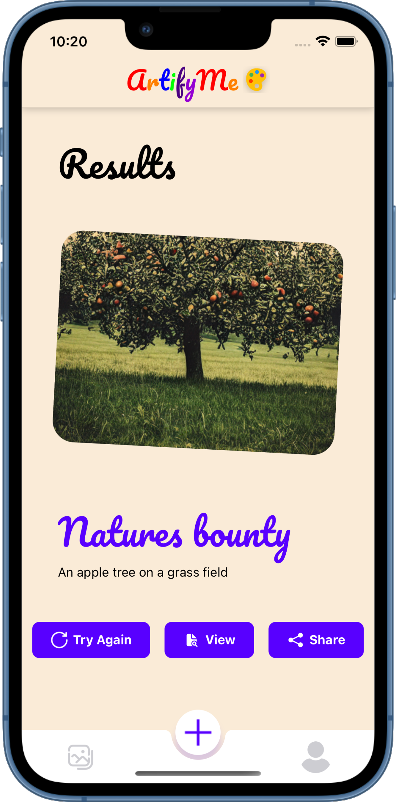 
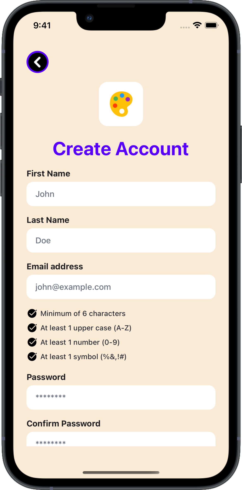 
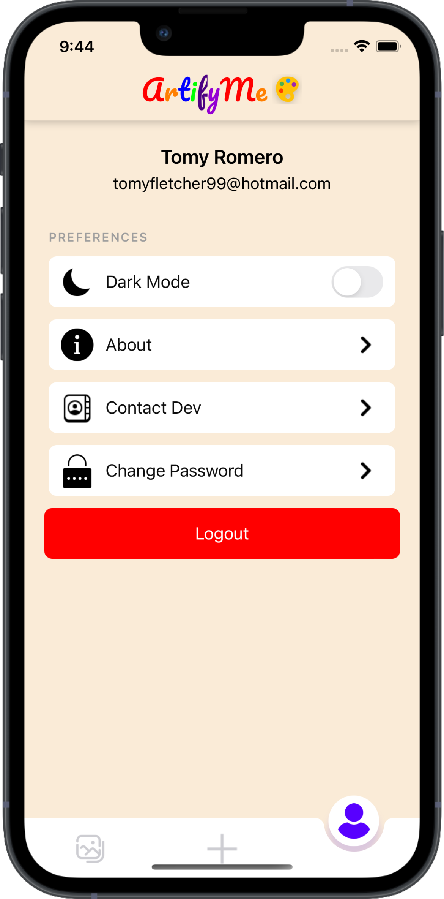 
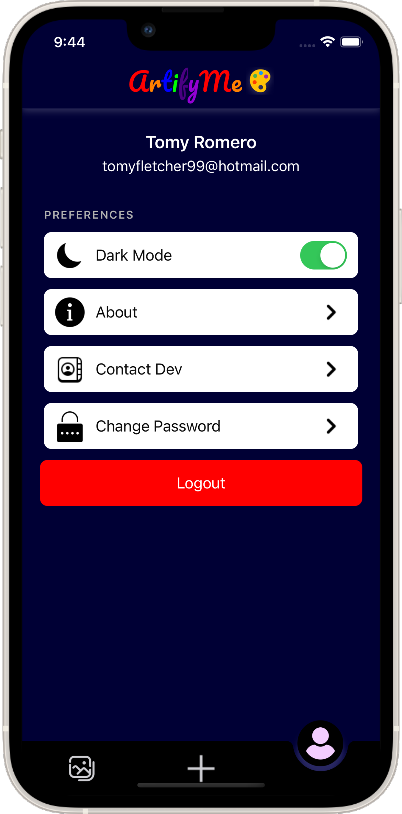 
 

## <a name="acknowledgments"> 🙌 Acknowledgments </a>
Shout out to https://loading.io/ and https://icons8.com/ for all the icons provided

## Future Updates
In the future, I would love to further optimize the app for Android devices and improve responsiveness across various screen sizes. Additionally, I aim to enhance the AI model by training it more extensively to deliver even better results.