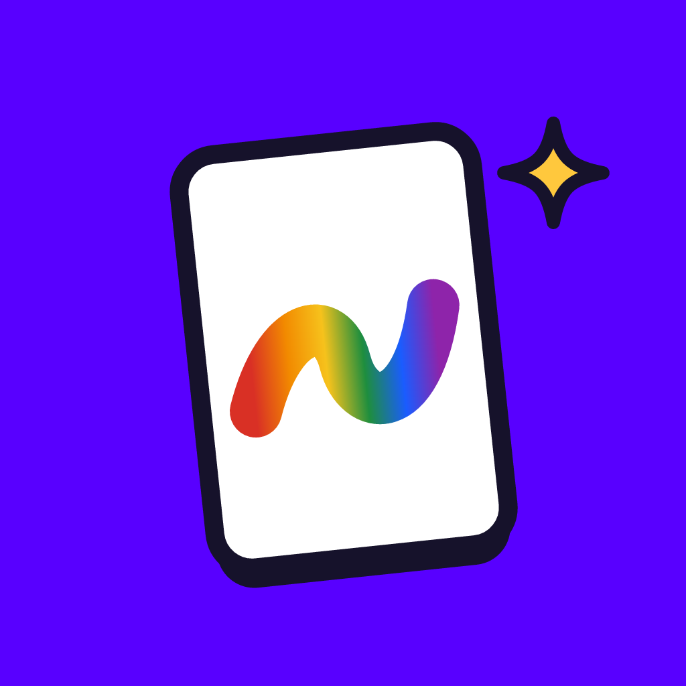

# ArtifyMe

Draw a sketch with your finger, say what it is, and ArtifyMe paints it: a Stable Diffusion model with ControlNet turns your lines into an artwork that follows them. It's a full-stack portfolio project with three parts:
- an Expo (React Native) app;
- an ASP.NET Core API;
- a Python image service.

## 📋 Contents

- [Screenshots](#screenshots)
- [Features](#features)
- [Architecture](#architecture)
- [Tech stack](#tech-stack)
- [Project structure](#project-structure)
- [Running it](#running-it)
- [Testing and CI](#testing-and-ci)
- [Database schema](#database-schema)
- [Contact](#contact)
- [Acknowledgments](#acknowledgments)

## <a name="screenshots">📸 Screenshots</a>

<table>
  <tr>
    <td>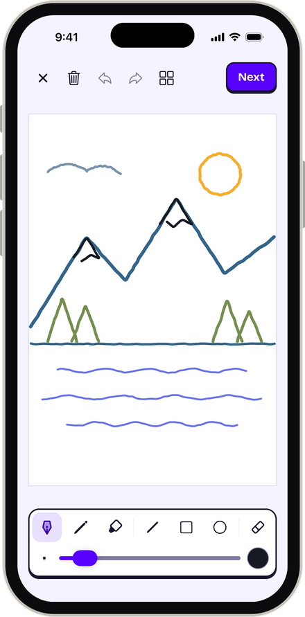</td>
    <td>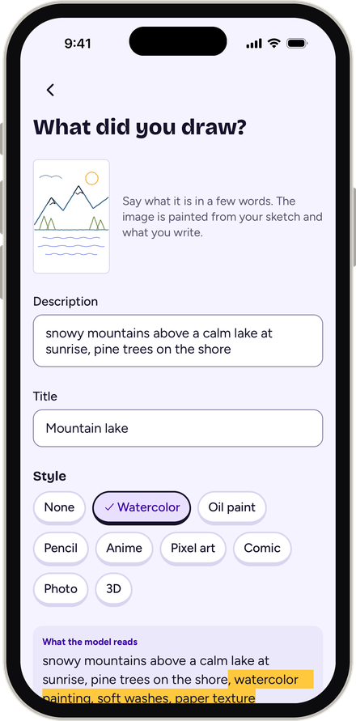</td>
    <td>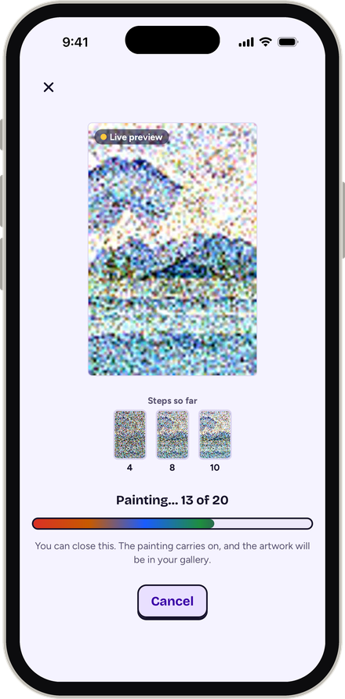</td>
    <td>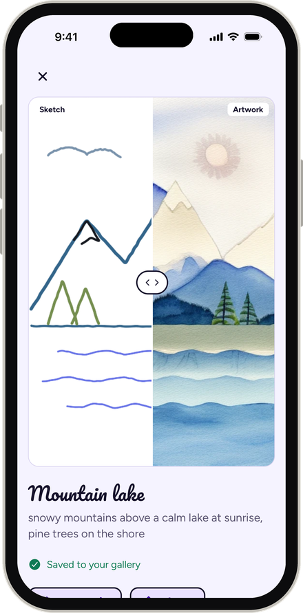</td>
  </tr>
  <tr>
    <td>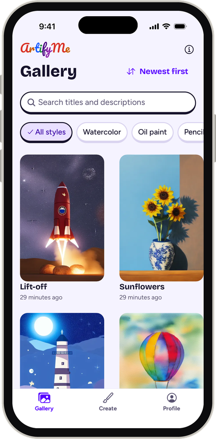</td>
    <td>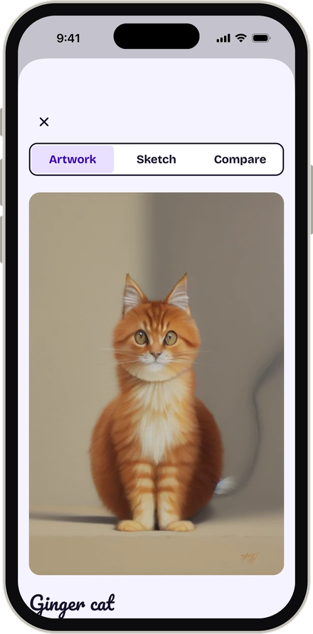</td>
    <td>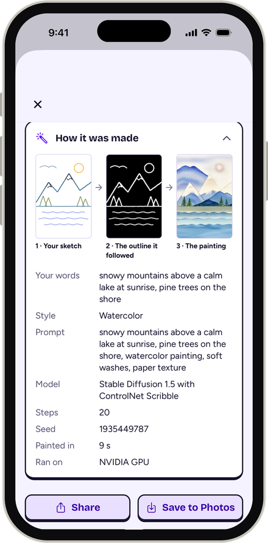</td>
    <td>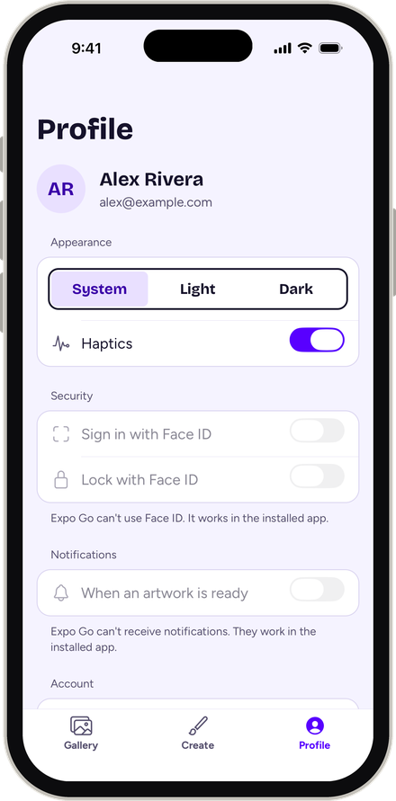</td>
  </tr>
  <tr>
    <td>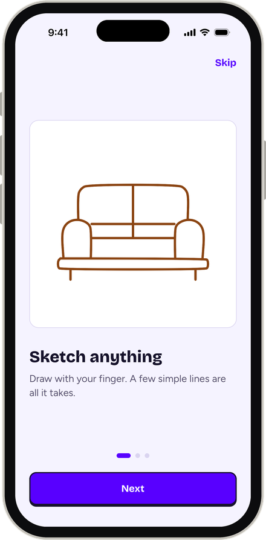</td>
    <td>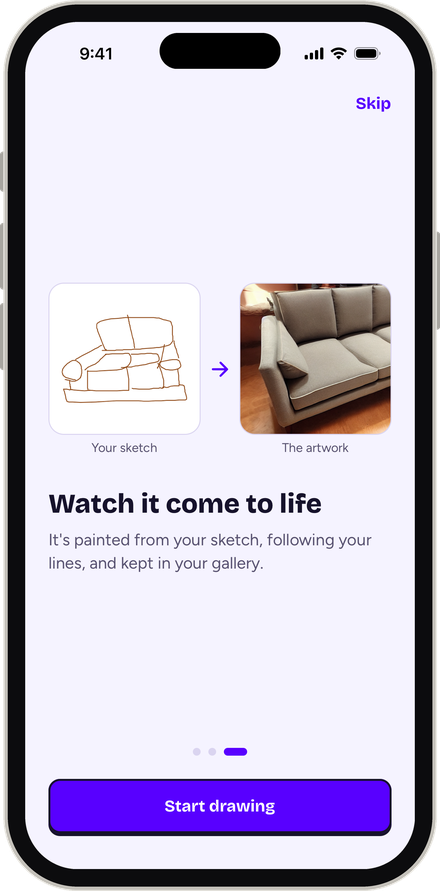</td>
    <td>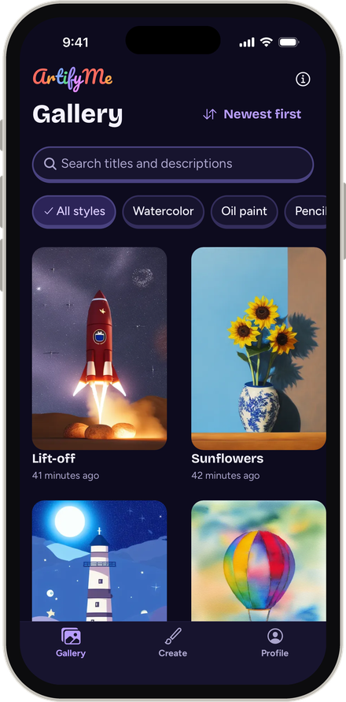</td>
    <td>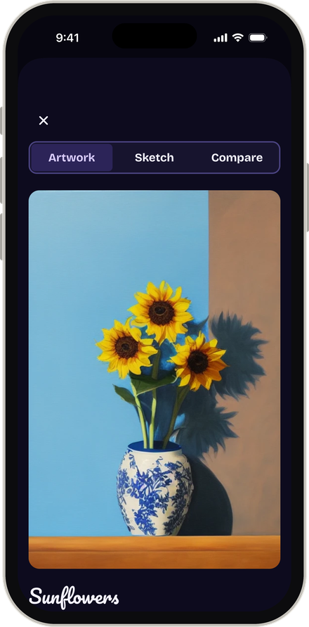</td>
  </tr>
</table>

## <a name="features">🚀 Features</a>

- **Drawing:** a canvas that feels like paper.
  - Pen, pencil and marker brushes, and lines, rectangles and ellipses dragged from corner to corner.
  - Strokes are smoothed as you draw.
  - Undo and redo, including with a two-finger tap.
  - An eraser, a size slider, 18 named colors and a guide grid that stays out of the finished sketch.
  - The sketch is saved as a draft, so closing the app loses nothing.
- **Making art:**
  - You describe the sketch and give it a title, suggested from your words.
  - Style chips (Watercolor, Oil paint, Pencil…) add to the prompt, and the app shows exactly what the model reads.
  - The image is made on the server as a tracked job. The app shows the queue position, then the painting itself sharpening step by step, with a strip of earlier steps to look back at.
  - Closing the app doesn't stop the painting; the artwork is waiting in the gallery.
  - An optional notification says when the artwork is ready, or why it wasn't made, and opens it with a tap.
  - The finished artwork is revealed from its sketch, and a slider compares the two: drag it or tap anywhere on the picture. It sweeps across once to show it moves.
  - Each artwork keeps how it was made: the sketch, the outline the model followed, the prompt, model, seed, steps, time and device.
- **Gallery:** a grid that loads as it scrolls. Search titles and descriptions, filter by style, and sort newest or oldest first. A long press opens a native menu (Share, Save to Photos, Edit, Delete). Artworks open full screen, with pinch-to-zoom on iOS.
- **Accounts:**
  - Sign-in sessions with rotating refresh tokens.
  - Optional Face ID (or fingerprint) sign-in: signing out keeps the session behind the phone's biometrics, never a stored password. An optional lock also asks for Face ID each time the app opens.
  - A list of signed-in devices by model, any of which can be signed out remotely.
  - Password changes, and account deletion from the app.
  - Password managers fill in and suggest passwords.
- **Accessibility:**
  - Screen reader labels, hints and announcements throughout, with every artwork's actions on the rotor.
  - Text that grows with the phone's setting, with headings capped so words never split.
  - Reduce Motion is respected everywhere.
  - The palette's text and control colors are tested against WCAG AA contrast.
- **Feel:** Light, Dark or System appearance, purposeful haptics, and a first-launch welcome.

## <a name="architecture">🏗️ Architecture</a>

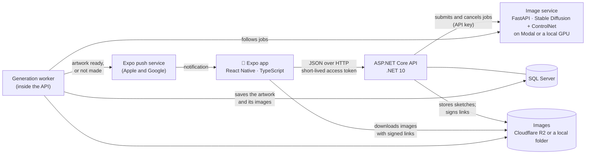
```mermaid
flowchart LR
    App["📱 Expo app<br/>React Native · TypeScript"]
    API["ASP.NET Core API<br/>.NET 10"]
    Worker["Generation worker<br/>(inside the API)"]
    DB[("SQL Server")]
    Images[("Images<br/>Cloudflare R2 or a local folder")]
    Inference["Image service<br/>FastAPI · Stable Diffusion + ControlNet<br/>on Modal or a local GPU"]
    Push["Expo push service<br/>(Apple and Google)"]

    App -- "JSON over HTTP<br/>short-lived access token" --> API
    API --- DB
    API -- "stores sketches;<br/>signs links" --> Images
    App -- "downloads images<br/>with signed links" --> Images
    API -- "submits and cancels jobs<br/>(API key)" --> Inference
    Worker -- "follows jobs" --> Inference
    Worker -- "saves the artwork<br/>and its images" --> DB
    Worker --> Images
    Worker -- "artwork ready,<br/>or not made" --> Push
    Push -- "notification" --> App
```

- **The app talks only to the API.** The API stores the sketch and starts a generation, and a background worker in the API follows it with the image service. A generation is a row in the database, so it survives the app closing and the API restarting. The database allows one generation in progress per user.
- **The image service** runs Stable Diffusion 1.5 with ControlNet's scribble model, one image at a time, on CUDA, an Apple GPU or the CPU, or on a cloud GPU with Modal. The picture is painted from the words, in 20 steps, while ControlNet holds it to the outline of the sketch. Each step's progress comes with a small preview decoded straight from the model's latents. A mock mode returns a quick stand-in image, so the rest of the app can run without the model.
- **Images are private.** They're stored per user in Cloudflare R2, or in a local folder when R2 isn't set up. The app gets links signed for an hour, never public URLs: R2's own presigned links, or links the API signs and serves itself for the local folder.
- **Notifications:** when a generation ends, the worker sends a push notification through Expo's push service to each phone the owner is signed in on. A phone's push token is kept with its session, so signing out or removing the device stops them, and a cancelled generation sends nothing.
- **The canvas works in the model's units.** The artboard is 512 × 768, the size the model paints, so the sketch it receives is exactly what was drawn.
- **Sessions:**
  - each phone gets a 15-minute access token and a 90-day refresh token, which is replaced on every use;
  - a reused refresh token ends that session;
  - changing the password signs out the other phones;
  - deleting the account signs out all of them.

How a sketch becomes an artwork:

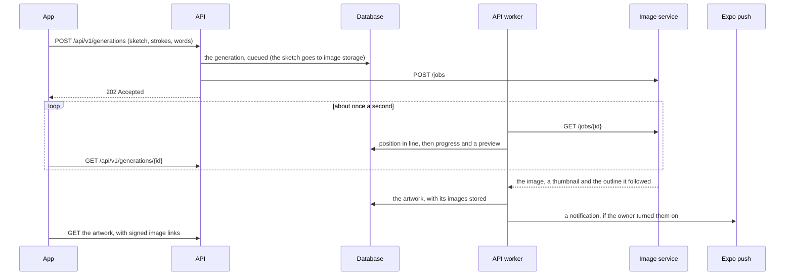
```mermaid
sequenceDiagram
    participant App
    participant API
    participant DB as Database
    participant Worker as API worker
    participant Model as Image service
    participant Push as Expo push
    App->>API: POST /api/v1/generations (sketch, strokes, words)
    API->>DB: the generation, queued (the sketch goes to image storage)
    API->>Model: POST /jobs
    API-->>App: 202 Accepted
    loop about once a second
        Worker->>Model: GET /jobs/{id}
        Worker->>DB: position in line, then progress and a preview
        App->>API: GET /api/v1/generations/{id}
    end
    Model-->>Worker: the image, a thumbnail and the outline it followed
    Worker->>DB: the artwork, with its images stored
    Worker->>Push: a notification, if the owner turned them on
    App->>API: GET the artwork, with signed image links
```

## <a name="tech-stack">⚙️ Tech stack</a>

| Part | Built with |
|---|---|
| App | Expo SDK 57, React Native 0.86, React 19, TypeScript, Expo Router, TanStack Query, React Native Gesture Handler, react-native-svg, Expo Haptics, Expo Notifications |
| API | ASP.NET Core on .NET 10, Entity Framework Core with SQL Server, JWT bearer auth, rate limiting, the AWS SDK for Cloudflare R2 |
| Image service | Python 3.12, FastAPI, Hugging Face diffusers (Stable Diffusion 1.5 and ControlNet scribble), uv, Modal |
| Tests | Jest and React Native Testing Library; xUnit v3 with SQLite; pytest |
| Tooling | Docker Compose, GitHub Actions, EF Core migrations, ESLint, Prettier, Ruff, dotnet format, gitleaks |

## <a name="project-structure">🗂️ Project structure</a>

```
frontend/            The Expo app
  src/app/           Screens, one file per route (Expo Router)
  src/api/           The typed API client
  src/components/    UI kit (ui/), canvas, artwork, shared and welcome pieces
  src/hooks/, lib/   Data fetching, the studio, drawing, preferences, sessions
  src/theme/         Color, type, spacing and motion tokens
backend/             The API, grouped by feature
  Artworks/ Auth/ Generations/ Images/ Inference/ Users/ Data/ Migrations/
backend.Tests/       API tests against the real pipeline, with SQLite, an in-memory R2 and a fake image service
inference/           The image service (app/), its tests, and its Modal deploy (modal_app.py)
compose.yaml         SQL Server, and with --profile app the API and image service
.github/workflows/   CI
```

## <a name="running-it">🛠️ Running it</a>

There are two ways to run the server side: everything in Docker, or each part on its own for development. Either way, the app then runs on a phone in Expo Go.

### What you need

- [Docker](https://www.docker.com/). SQL Server needs about 2 GB of Docker's memory. Microsoft publishes SQL Server for Intel only, so on Apple silicon first turn on "Use Rosetta for x86_64/amd64 emulation on Apple Silicon" in Docker Desktop's settings; without it, SQL Server crashes on startup.
- [Node.js](https://nodejs.org/) 22, and [Expo Go](https://expo.dev/go) on a phone.
- For development only: the [.NET 10 SDK](https://dotnet.microsoft.com/download) and [uv](https://docs.astral.sh/uv/).

Then clone the repository: `git clone https://github.com/tomyRomero/artifyme`

### Images

Out of the box, the API keeps images in a local folder: `backend/storage/`, or a Docker volume when it runs in Docker. Nothing needs setting up.

To keep them in Cloudflare R2 instead:
1. In the Cloudflare dashboard, create a bucket. Leave public access off: the app gets signed links.
2. Create an API token with Object Read & Write on that bucket only.
3. Give the API four settings, as shown in the steps below: the bucket's name, the account's S3 API address (`https://<account id>.r2.cloudflarestorage.com`), and the token's access key ID and secret.

Either way, the app only ever gets links that expire after an hour.

### Everything in Docker

The image service runs in mock mode, which returns a quick stand-in image instead of running the model.

1. Copy `.env-example` to `.env`.
2. Set `MSSQL_SA_PASSWORD`, and set `JWT_SECRET` to the output of `openssl rand -base64 48`. To use R2, also fill in the four `R2_` settings.
3. Start it all: `docker compose --profile app up -d --build --wait`.

The API is then on port 5038. Next, start [the app](#the-app).

To stop everything, run `docker compose --profile app down`. The database and images stay in Docker volumes for next time; `down -v` deletes them too.

### For development

**Database:**
1. Copy `.env-example` to `.env` and set `MSSQL_SA_PASSWORD`.
2. Run `docker compose up -d --wait`.

This starts only SQL Server, on port 14331, reachable only from your computer.

**API:**
1. Give the API its settings with [user-secrets](https://learn.microsoft.com/aspnet/core/security/app-secrets), which keeps them out of the repository:
   ```
   dotnet user-secrets set "ConnectionStrings:DefaultConnection" "Server=localhost,14331;Database=ArtifyMe;User ID=sa;Password=<your MSSQL_SA_PASSWORD>;TrustServerCertificate=True" --project backend
   dotnet user-secrets set "JwtSettings:Secret" "$(openssl rand -base64 48)" --project backend
   ```
   To use R2, add its four settings too:
   ```
   dotnet user-secrets set "R2:Endpoint" "https://<account id>.r2.cloudflarestorage.com" --project backend
   dotnet user-secrets set "R2:BucketName" "<bucket name>" --project backend
   dotnet user-secrets set "R2:AccessKeyId" "<access key ID>" --project backend
   dotnet user-secrets set "R2:SecretAccessKey" "<secret access key>" --project backend
   ```
2. Run `dotnet run --project backend`. It listens on port 5038 on every network interface, so a phone on the same network can reach it, and it applies migrations on startup.
3. To change the schema, run `dotnet tool restore`, then `dotnet ef migrations add <Name> --project backend`.

**Image service:**
1. Run `cd inference && uv sync`.
2. Run `uv run uvicorn app.main:app --port 8000`.

This is mock mode. For real images:
- The model needs about 8 GB of free memory, and the first run downloads about 3 GB of weights.
- Install it with `uv sync --extra real`, then start the service with `INFERENCE_MODE=real` and an `INFERENCE_API_KEY` of your choice.
- Give the API the same key: `dotnet user-secrets set "Inference:ApiKey" "<key>" --project backend`.
- On a Mac, run it this way rather than in Docker, where it can't use the Apple GPU.

**Real images on a free cloud GPU:**

Without a GPU or 8 GB of free memory, the model can run on [Modal](https://modal.com) instead. Its free plan includes $30 of compute a month, and a painting takes a few seconds on the T4 GPU it uses. The service stops 10 minutes after its last request, so it costs nothing while idle.
1. Create a Modal account and add a payment method, which GPUs need even within the free credits. Then run `uv tool install modal` and `modal setup`.
2. Store the API's key as a Modal secret: `modal secret create artifyme-inference INFERENCE_API_KEY=<key>`. Give the API the same key, as above.
3. Run `cd inference && modal deploy modal_app.py`. The first deploy takes several minutes, while Modal installs the packages and downloads the weights into the image.
4. Point the API at the address the deploy prints: `dotnet user-secrets set "Inference:BaseUrl" "https://<workspace>--artifyme-inference-web.modal.run" --project backend`.

Once stopped, the service starts again on the next request, which takes about 40 seconds while the model loads. A painting started in that time can fail to start; trying again works.

### <a name="the-app">The app</a>

1. Run `cd frontend && npm install`.
2. Copy `frontend/.env-example` to `frontend/.env` and set `EXPO_PUBLIC_DOTNET_API_URL` to the API's address. On a phone, use the computer's address on the local network, for example `http://192.168.1.20:5038`, with both on the same network. On a simulator, `http://localhost:5038` works.
3. Run `npm start` (Expo runs on port 8082), then scan the QR code to open the app in Expo Go: with the Camera app on an iPhone, or from Expo Go on Android.
4. Create an account in the app. Drawing works without one, but making an artwork needs one.

If the phone can't reach the API, check that the address in `frontend/.env` is still the computer's (it can change), and that the computer's firewall allows incoming connections to the API. Restart Expo after changing `.env`.

Expo Go can't use Face ID on an iPhone, so the Face ID settings stay off there. They work in a development build (`npx expo run:ios`) or an installed app.

Notifications need a little more, because Expo Go can't receive them at all:
1. Link the app to an Expo project with `npx eas-cli init`. It adds the project's ID to `app.json`; without one, the app hides its notification settings.
2. On an iPhone, push needs a paid Apple Developer account. `npx eas-cli credentials` makes the push key and gives it to Expo, which delivers the API's notifications.
3. Install a development build on the phone with `npx expo run:ios --device`.

## <a name="testing-and-ci">✅ Testing and CI</a>

- **App:**
  - `cd frontend && npm test`. Jest with React Native Testing Library, testing screens the way they're used: by role, label and gesture. A test that makes no assertion fails, so none can pass by checking nothing.
  - `npm run lint`, `npm run format:check` and `npm run typecheck`.
- **API:** `dotnet test`. The tests run against the real request pipeline, with SQLite in memory, an in-memory R2 bucket, a fake image service and a fake push sender, so they need no SQL Server, R2 account, model or Expo account.
- **Image service:** `cd inference && uv run pytest`, in mock mode.

On every push, GitHub Actions:
- builds and tests all three parts;
- checks formatting and lints;
- applies the migrations to a real SQL Server;
- builds the iOS bundle and both Docker images;
- scans the history for secrets.

## <a name="database-schema">📊 Database schema</a>

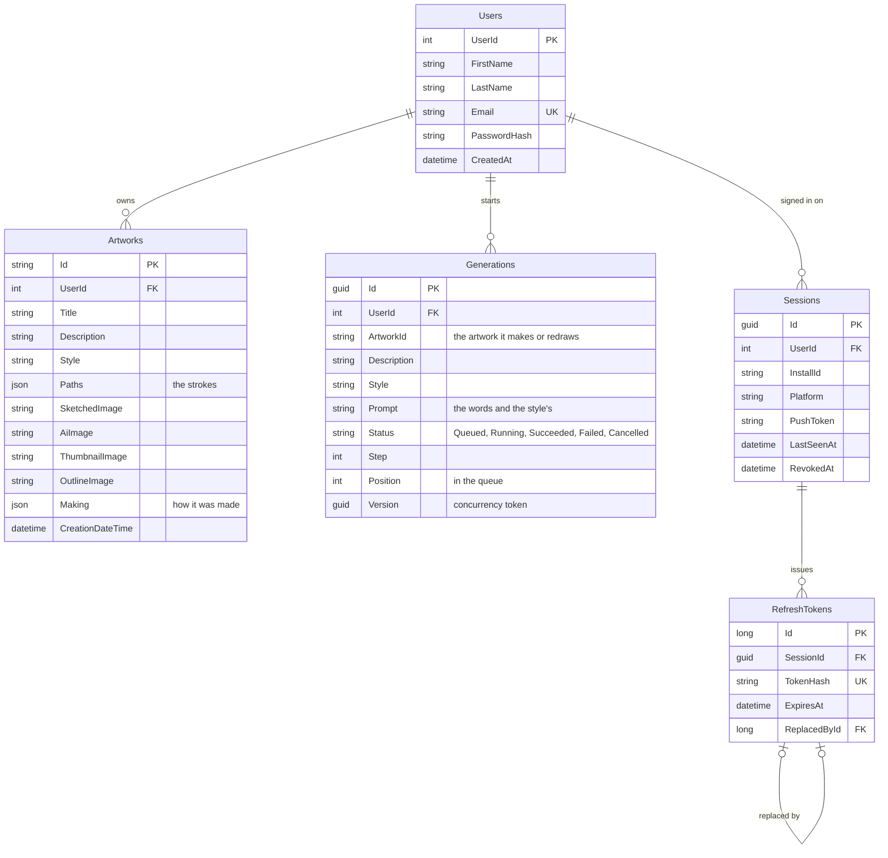
```mermaid
erDiagram
    Users ||--o{ Artworks : owns
    Users ||--o{ Generations : starts
    Users ||--o{ Sessions : "signed in on"
    Sessions ||--o{ RefreshTokens : issues
    RefreshTokens |o--o| RefreshTokens : "replaced by"

    Users {
        int UserId PK
        string FirstName
        string LastName
        string Email UK
        string PasswordHash
        datetime CreatedAt
    }
    Artworks {
        string Id PK
        int UserId FK
        string Title
        string Description
        string Style
        json Paths "the strokes"
        string SketchedImage
        string AiImage
        string ThumbnailImage
        string OutlineImage
        json Making "how it was made"
        datetime CreationDateTime
    }
    Generations {
        guid Id PK
        int UserId FK
        string ArtworkId "the artwork it makes or redraws"
        string Description
        string Style
        string Prompt "the words and the style's"
        string Status "Queued, Running, Succeeded, Failed, Cancelled"
        int Step
        int Position "in the queue"
        guid Version "concurrency token"
    }
    Sessions {
        guid Id PK
        int UserId FK
        string InstallId
        string Platform
        string PushToken
        datetime LastSeenAt
        datetime RevokedAt
    }
    RefreshTokens {
        long Id PK
        guid SessionId FK
        string TokenHash UK
        datetime ExpiresAt
        long ReplacedById FK
    }
```

## <a name="contact">📫 Contact</a>

Made by Tomy F. Romero. Questions about the project are welcome at tomyfletcher99@hotmail.com.

© 2024–2026 Tomy F. Romero. All rights reserved. The code is public to read, but isn't licensed for reuse; see [LICENSE](LICENSE).

[](https://www.linkedin.com/in/tomyromero/)
[](https://tomyromero.vercel.app)

## <a name="acknowledgments">🙌 Acknowledgments</a>

- [Stable Diffusion 1.5](https://huggingface.co/stable-diffusion-v1-5/stable-diffusion-v1-5) and [ControlNet's scribble model](https://huggingface.co/lllyasviel/control_v11p_sd15_scribble), through Hugging Face [diffusers](https://github.com/huggingface/diffusers).
- [Ionicons](https://ionic.io/ionicons) for the icons.
- [Bricolage Grotesque](https://fonts.google.com/specimen/Bricolage+Grotesque), [Figtree](https://fonts.google.com/specimen/Figtree) and [Pacifico](https://fonts.google.com/specimen/Pacifico) from Google Fonts.
